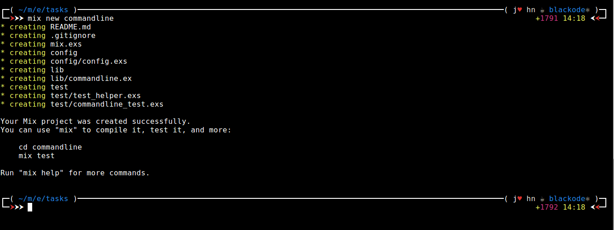
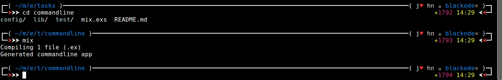
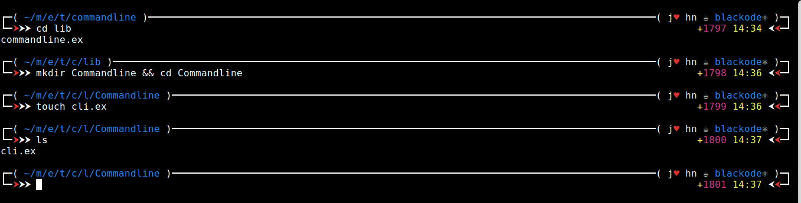
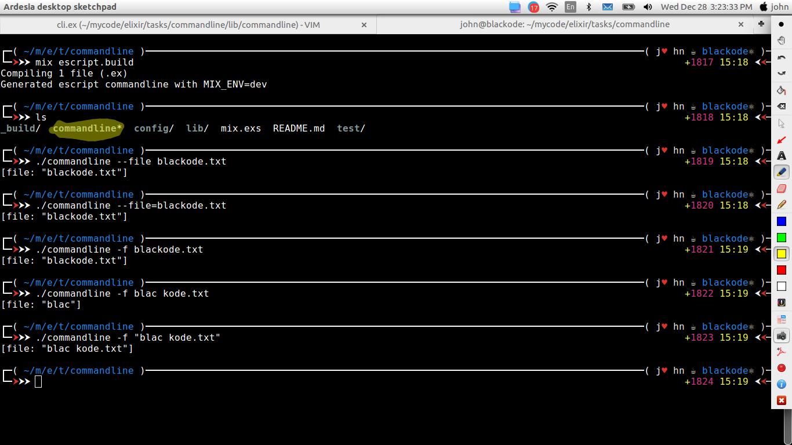

# Writing The Command Line Application in Elixir

Hi and Hello Every Elixirian.

After Learning the Elixir basics, I struck then. I have no idea of how to put my **Elixir** Knowledge in practice. I want to move next level, but I am helpless. I am not that expert in elixir to work on innovative projects by myself that too alone.  But I still managed with **iex	**, but that does not last long. I Google and found the article on this topic , that really innovative for Intermediate level Elixir Programmer. So, I had thought of sharing and I added a bit of scent and explanation with clear steps. 

### Creating the Mix project

```shell
mix new commandline
```



After creating the project dive into the folders of project.

You will find the `lib` folder which holds the application code base and `mix.exs` file which is holding the application or project meta data like dependencies, creator, links, etc...

Now run `mix` to compile your app the first time after changing the directory to app root path.



### Escript

Elixir uses `escript` to build an executable file that runs as normal script . Its only dependency is Erlang installed on your machine. Elixir is not necessary, since `escript` embedds Elixir into the compiled app. At first we need to set the `main_module` in `mix.exs`by extending the existing function:

`escript: [main_module: Commandline.CLI]` add this line in the **project** definition

```elixir
def project do
  [app: :commandline,
  version: "0.1.0",
  elixir: "~> 1.3",
  escript: [main_module: Commandline.CLI],  # You have to add this extraline
  deps: deps]
end
```

### Creating `main_module`

This `main_module` will act as the **entry point** for the command line application. This `main_module` should contain one `main/1` function. Lets create the `Commandline.CLI` module with `main/1` function.

Go to the `lib` directory and create new directory `commandline` and new file `cli.ex` with `main/defintion`



Now open `cli.ex` file and edit as follows.

```elixir
defmodule Commandline.CLI do  #do not forget the namespace here
  def main(args) do
    {opts,_,_}= OptionParser.parse(args,switches: [file: :string],aliases: [f: :file])
    IO.inspect opts #here I just print the options 
  end
end
```

**args** holds the command line arguments you will pass while executing the file.

`OptionsParser.parse` This parse the command line arguments and returns the tuple containing three values where we're only interested in the first one. The second element holds remaining arguments and the last one invalid options. `opts` is a Keyword list containing all options converted to **atoms** with their associated value.. 

To explain this I will take one example.

Suppose you need to pass the **filename** as an option you can do that as follows .

Consider the `commandline` is executable file here

`./commandlne --file "blackode.txt"`  here `--file` is switch. You can pass as many you want. Herr you can access that filenames as `opts[:file]` which returns the `string`

`./commandline -f "blackode.txt"` here `-f` we have created aliases for `file` so we can access this as `opts[:file]` too as well. 

Both approaches are very common for passing the data through the command line.

### Building and Execution

To build the application you have to be in **root** path of the application and run the following command.

```shell
mix escript.build
```

This creates the executable file with name `commandline` 

Run the Executable file with an argument

```shell
./commandline --file filename
```

or

```shell
./commandline --file=filename
```

If the file name contains the space wrap name inside the double quotes as **"file name"**

or 

```shell
./commandline -f filename
```

The main function of the module takes all arguments, parses them and outputs a string to `stdout`



The yellow marked is our executable file

If you find this article helpful share 💙 and we welcome your feedback with honor 💐